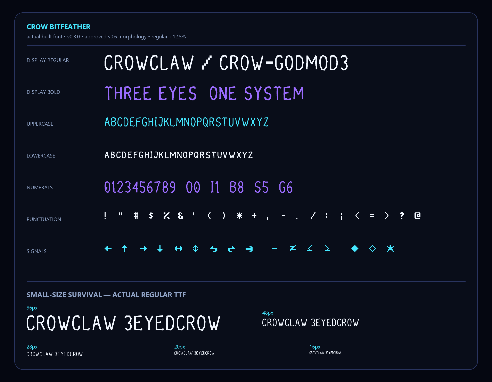
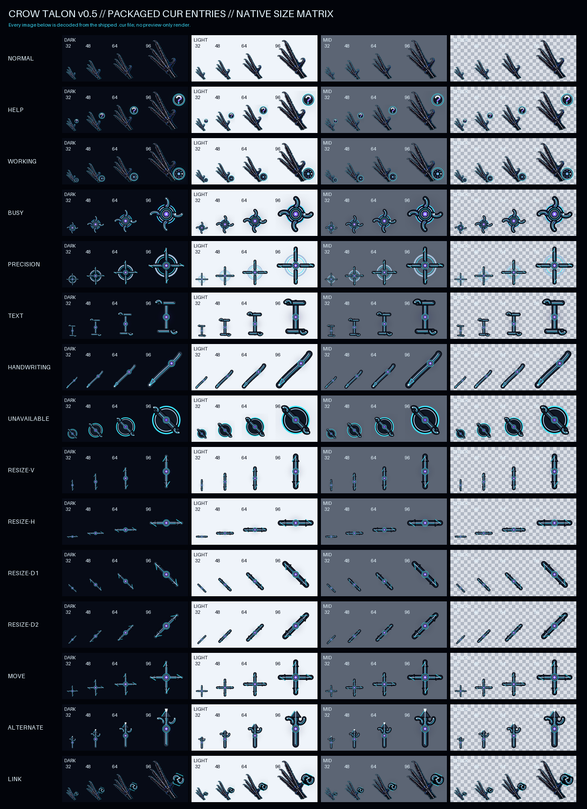

# Crow Brand System

The canonical visual system for CrowClaw, Crow-GodMod3, CrowQuant, CrowNest,
CrowMemory, CrowFlix, and future Crow products.

Version `0.2.0` is the Crow-GodMod3 integration release. Its current interface
components are Crow Bitfeather v0.3.0 and Crow Talon v0.5.0, alongside the
approved mascot, cross-product design tokens, application icons, reusable
backgrounds, social exports, and text-safe hero artwork for six products.


## Approved character

[`crow-mascot-v3.png`](assets/mascots/masters/crow-mascot-v3.png) is the sole
active Crow mascot across every current and future Crow product.

| Identity | Role | Master |
| --- | --- | --- |
| Canonical Crow v3 | Sole mascot for full, compact, icon, hero and editorial use | [`crow-mascot-v3.png`](assets/mascots/masters/crow-mascot-v3.png) |

The mascot is a naturally proportioned adult crow with exactly three eyes: two
physical eyes and one forehead eye. Its tapered corvid beak, dominant feather
mass and integrated biomechanical anatomy remain fixed. Orange, amber, yellow,
and gold are not Crow Theme colours.

Earlier head, humanoid and companion masters remain in
`assets/mascots/masters/` as inactive legacy/reference records. They are
preserved for provenance and must not be used as active product identities.

## Original type

Crow Bitfeather is generated from original, hand-authored stepped-pixel
geometry. No third-party font file or outline is consumed. Version 0.3.0
slightly thickens the approved BITFEATHER direction so the feather-and-talon
character remains clear at practical interface sizes.

- Crow Bitfeather Display Regular and Bold
- Crow Bitfeather Mono Regular and Bold
- Desktop `.ttf` and web `.woff2`
- Printable Basic Latin plus useful arrows, operators, and signal glyphs



The fonts are not installed automatically. To install them for the current
Windows user:

```powershell
.\fonts\bitfeather\install.ps1
```

Use `.\fonts\bitfeather\uninstall.ps1` to remove them. The earlier Crow Signal
files remain as legacy/reference material and are not the active site typeface.

## Original Windows pointers

Crow Talon is an original pointer scheme drawn and built by
[`scripts/build_cursors_v05.py`](scripts/build_cursors_v05.py). Version 0.5.0
uses the approved compact cybernetic crow-claw hand and includes 15 static
multi-resolution cursor roles, animated Working and Busy states, explicit
hotspots, visual proofs, and per-user installation scripts.



The cursor scheme is not installed automatically. To install it for the
current Windows user:

```powershell
.\cursors\v0.5\install.ps1
```

Use `.\cursors\v0.5\uninstall.ps1` to remove only v0.5. The live website uses
the compact 32px PNG sources directly and does not install anything on the
visitor's computer.

## Icons and artwork

- [`assets/marks/crow-signal-master.png`](assets/marks/crow-signal-master.png)
  is a square signal crop derived from the canonical Crow.
- [`assets/icons/`](assets/icons/) contains 16–1024 px icons, rounded app
  icons, avatars, and a multi-resolution ICO.
- [`assets/backgrounds/`](assets/backgrounds/) contains the neutral void-grid
  system and practical wallpaper exports.
- [`assets/product-variants/`](assets/product-variants/) contains text-safe
  hero artwork for the six current Crow products. Each uses the same mascot;
  only crop, background and accent emphasis vary.
- [`assets/social/`](assets/social/) contains Crow banners, Open Graph,
  repository, square-post, and story formats.


## Theme tokens

Import the original fonts and theme tokens:

```css
@import "./fonts/bitfeather/crow-bitfeather.css";
@import "./tokens/crow-theme.css";
```

Bind a product at the application root:

```html
<main data-crow-theme data-crow-product="crowclaw">
  ...
</main>
```

Machine-readable equivalents are supplied as JSON and TypeScript. See
[`docs/BRAND-GUIDE.md`](docs/BRAND-GUIDE.md) and
[`docs/MASCOT-GUIDE.md`](docs/MASCOT-GUIDE.md).

## Rebuild

The project uses an isolated Python environment:

```powershell
.\setup.ps1
.\build.ps1
```

The individual build stages are:

```powershell
.\.venv\Scripts\python.exe .\scripts\build_fonts.py
.\.venv\Scripts\python.exe .\scripts\build_cursors.py
.\.venv\Scripts\python.exe .\scripts\build_visual_assets.py
.\.venv\Scripts\python.exe .\scripts\build_icons.py
.\.venv\Scripts\python.exe .\scripts\build_raster_exports.py
.\.venv\Scripts\python.exe .\scripts\build_manifest.py
.\.venv\Scripts\python.exe .\scripts\validate_pack.py
```

Approved masters are never overwritten by these scripts.

## Publication status

Crow explicitly approved this copy for the public Crow-GodMod3 integration.
The standalone Crow Brand System repository remains separate and local. See
[`LICENSE.md`](LICENSE.md) for the asset notice that applies to this bundled
copy.
