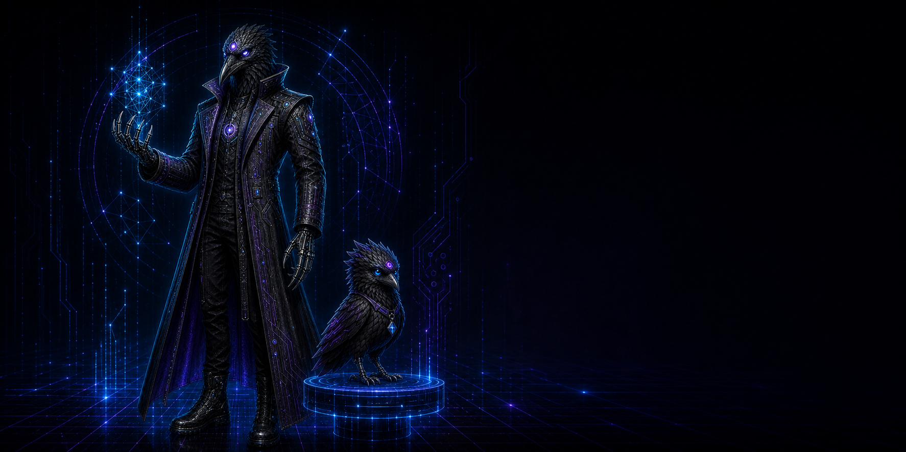
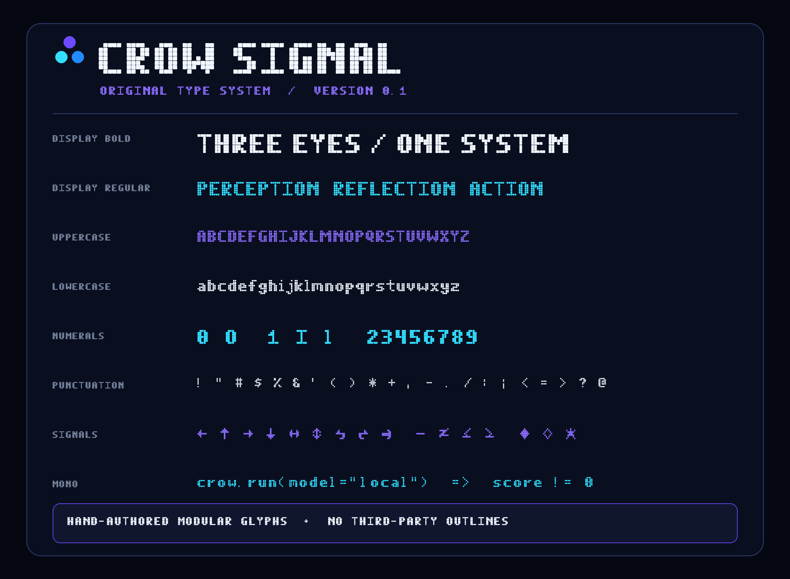
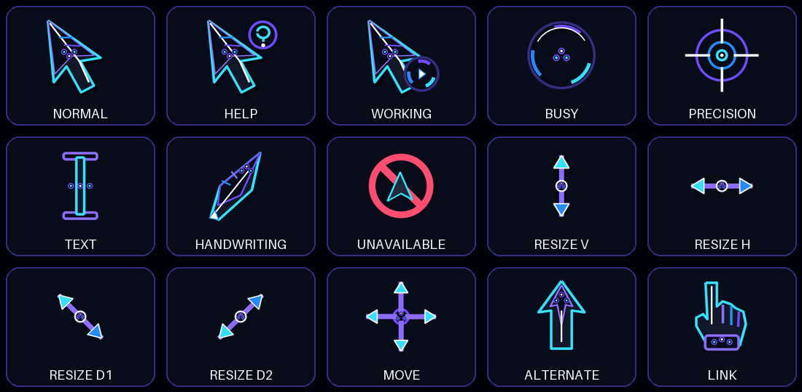
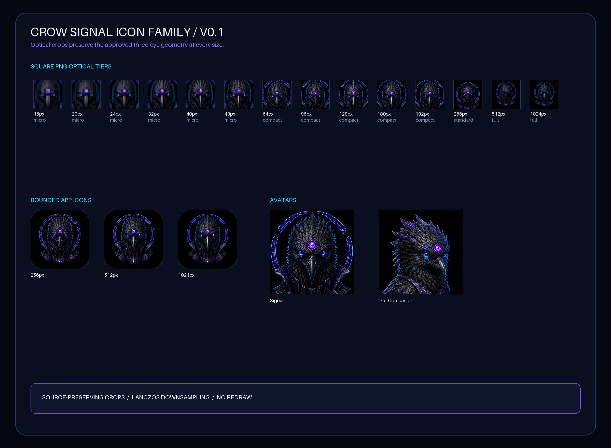

# Crow Brand System

The canonical visual system for CrowClaw, Crow-GodMod3, CrowQuant, CrowNest,
CrowMemory, CrowFlix, and future Crow products.

Version `0.1.0` is the Crow-GodMod3 integration preview. It contains the approved mascot family,
original Crow Signal fonts, original Crow Talon Windows cursors, cross-product
design tokens, application icons, reusable backgrounds, social exports, and
text-safe hero artwork for six products.



## Approved character family

| Form | Role | Master |
| --- | --- | --- |
| Core Architect | Canonical flagship intelligence | [`core-architect.png`](assets/mascots/masters/core-architect.png) |
| Field Operator | Grounded builder and researcher | [`field-operator.png`](assets/mascots/masters/field-operator.png) |
| Glitch Ascendant | Controlled transformed state | [`glitch-ascendant.png`](assets/mascots/masters/glitch-ascendant.png) |
| Pet Companion | Small non-humanoid companion | [`pet-companion.png`](assets/mascots/masters/pet-companion.png) |

Every form has exactly three eyes: two physical eyes and one forehead eye. The
head remains an elongated crow head with a tapered beak. Orange, amber, yellow,
and gold are not Crow Theme colours.

## Original type

Crow Signal is generated from original, hand-authored modular geometry. No
third-party font file or outline is consumed.

- Crow Signal Display Regular and Bold
- Crow Signal Mono Regular and Bold
- Desktop `.ttf` and web `.woff2`
- Printable Basic Latin plus useful arrows, operators, and signal glyphs



The fonts are not installed automatically. To install them for the current
Windows user:

```powershell
.\fonts\install.ps1
```

Use `.\fonts\uninstall.ps1` to remove them.

## Original Windows pointers

Crow Talon is an original pointer scheme drawn and built by
[`scripts/build_cursors.py`](scripts/build_cursors.py). It includes 15 static
multi-resolution cursor roles, animated Working and Busy states, explicit
hotspots, a preview, and per-user installation scripts.



The cursor scheme is not installed automatically. To install it for the
current Windows user:

```powershell
.\cursors\install.ps1
```

Use `.\cursors\uninstall.ps1` to restore the previous scheme.

## Icons and artwork

- [`assets/marks/crow-signal-master.png`](assets/marks/crow-signal-master.png)
  is the master square signal artwork.
- [`assets/icons/`](assets/icons/) contains 16–1024 px icons, rounded app
  icons, avatars, and a multi-resolution ICO.
- [`assets/backgrounds/`](assets/backgrounds/) contains the neutral void-grid
  system and practical wallpaper exports.
- [`assets/product-variants/`](assets/product-variants/) contains text-safe
  hero artwork for the six current Crow products.
- [`assets/social/`](assets/social/) contains family banners, Open Graph,
  repository, square-post, and story formats.



## Theme tokens

Import the original fonts and theme tokens:

```css
@import "./fonts/crow-signal.css";
@import "./tokens/crow-theme.css";
```

Bind a product at the application root:

```html
<main data-crow-theme data-crow-product="crowclaw">
  ...
</main>
```

Machine-readable equivalents are supplied as JSON and TypeScript. See
[`docs/BRAND-GUIDE.md`](docs/BRAND-GUIDE.md) and
[`docs/MASCOT-GUIDE.md`](docs/MASCOT-GUIDE.md).

## Rebuild

The project uses an isolated Python environment:

```powershell
.\setup.ps1
.\build.ps1
```

The individual build stages are:

```powershell
.\.venv\Scripts\python.exe .\scripts\build_fonts.py
.\.venv\Scripts\python.exe .\scripts\build_cursors.py
.\.venv\Scripts\python.exe .\scripts\build_icons.py
.\.venv\Scripts\python.exe .\scripts\build_raster_exports.py
.\.venv\Scripts\python.exe .\scripts\build_manifest.py
.\.venv\Scripts\python.exe .\scripts\validate_pack.py
```

Approved masters are never overwritten by these scripts.

## Publication status

Crow explicitly approved this copy for the public Crow-GodMod3 integration.
The standalone Crow Brand System repository remains separate and local. See
[`LICENSE.md`](LICENSE.md) for the asset notice that applies to this bundled
copy.
